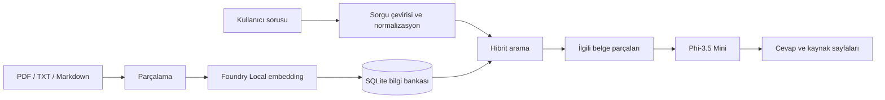

# Local RAG Assistant — Proje Raporu

## Problem

Kullanıcılar uzun PDF belgelerinde cevap ararken çok sayıda sayfayı elle taramak
zorunda kalıyor. Bulut tabanlı çözümler ise belge gizliliği ve internet bağlantısı
konusunda ek koşullar getiriyor.

## Çözüm

Bu proje, Microsoft Foundry Local ile tamamen cihazda çalışan bir RAG
(Retrieval-Augmented Generation) asistanı sunar. Sistem soruyu önce yerel olarak
arama sorgusuna dönüştürür, SQLite'taki embedding indeksinden ilgili belge
parçalarını seçer ve bulunan bağlamı yerel sohbet modeline verir. Sonuç, kullanılan
kaynak sayfalarıyla birlikte gösterilir.

## Mimari

## Kullanılan Teknolojiler

- Microsoft Foundry Local
- `phi-3.5-mini`: cevap üretimi
- `qwen2.5-1.5b`: Türkçe soruyu arama için İngilizceye çevirme
- `qwen3-embedding-0.6b`: yerel embedding üretimi
- SQLite: belge parçaları ve vektörlerin saklanması
- Streamlit: web arayüzü
- Pytest: birim testleri

## Çalışan Özellikler

- PDF, TXT ve Markdown belgelerini okuma
- Belgeleri parçalara ayırma ve SQLite'a kaydetme
- Yerel embedding oluşturma
- Embedding benzerliği, kelime örtüşmesi ve hafta/faz eşleşmesini birleştiren
  hibrit arama
- Türkçe soru kabul etme
- Foundry Local ile kaynaklı cevap üretme
- Komut satırı ve web arayüzü

## Doğrulama

Örnek soru: `Projenin 4. hafta hedefi nedir?`

Sistem, projenin dördüncü hafta sonunda SQLite bilgi bankasından getirilen
içerikle cevap üretebilen, çalışan bir soru-cevap uygulaması hedeflediğini buldu ve
PDF'in ilgili sayfalarını kaynak olarak gösterdi.

## Sınırlar ve Sonraki Adımlar

- İngilizce kaynaklarda cevap kalitesini korumak için MVP cevapları İngilizcedir.
- SQLite araması orta boy bilgi bankaları için uygundur; çok büyük koleksiyonlarda
  vektör veritabanı değerlendirilebilir.
- Sonraki sürümde belge yükleme, cevap geçmişi ve Türkçe cevap kalitesi
  geliştirilebilir.
