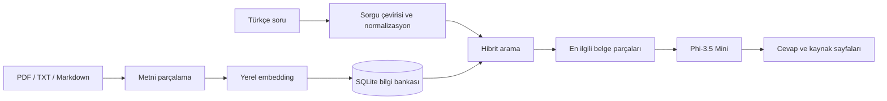

<div align="center">

# Microsoft Foundry Local RAG Asistanı

**PDF belgelerinden kaynaklı cevap üreten, tamamen cihaz içinde çalışan yapay zekâ asistanı**


</div>

## Proje Hakkında

Bu proje, Microsoft Foundry Local kullanarak PDF, TXT ve Markdown belgelerinde
anlamsal arama yapar. Kullanıcının sorusuyla en ilgili belge parçalarını bulur,
yerel dil modeline yalnızca bu bağlamı verir ve cevabın yanında kullanılan dosya
ile sayfa numaralarını gösterir.

Soru, belge ve model çıktıları cihazdan dışarı gönderilmez.

## Öne Çıkan Özellikler

- Tamamen yerel model çalıştırma
- PDF, TXT ve Markdown desteği
- Türkçe soru kabul etme
- Yerel embedding üretimi
- SQLite tabanlı bilgi bankası
- Anlamsal ve kelime tabanlı hibrit arama
- Kaynak dosya, sayfa ve ilgi puanı gösterimi
- Streamlit web arayüzü ve komut satırı desteği
- Otomatik birim testleri

## Nasıl Çalışır?



## Kullanılan Modeller

| Model | Görevi |
|---|---|
| `qwen3-embedding-0.6b` | Belge ve soru embedding'lerini üretir |
| `qwen2.5-1.5b` | Türkçe soruyu İngilizce arama sorgusuna dönüştürür |
| `phi-3.5-mini` | Getirilen belge bağlamından cevabı üretir |

## Kurulum

### Gereksinimler

- macOS Apple Silicon
- Python 3.12
- [Microsoft Foundry Local](https://learn.microsoft.com/en-us/azure/foundry-local/get-started)

### Projeyi hazırla

```bash
git clone https://github.com/akifbegtas/microsoft-foundry-local-rag-assistant.git
cd microsoft-foundry-local-rag-assistant

python3.12 -m venv .venv
source .venv/bin/activate
python -m pip install -r requirements.txt
```

## Kendi Belgelerini Ekle

1. PDF, TXT veya Markdown dosyalarını `documents/` klasörüne koy.
2. Belgeleri SQLite'a aktar:

```bash
python ingest.py
```

3. Yerel embedding indeksini oluştur:

```bash
python index_embeddings.py
```

İlk çalıştırmada embedding modeli indirileceği için işlem biraz uzun sürebilir.

## Uygulamayı Çalıştır

### Web arayüzü

```bash
streamlit run app.py
```

Tarayıcıda [http://localhost:8501](http://localhost:8501) adresini aç.

### Komut satırı

```bash
python main.py "Projenin 4. hafta hedefi nedir?"
```

Örnek çıktı:

```text
Each team has a working Q&A application that can return an answer generated
by the local LLM using retrieved content from their SQLite-backed knowledge base.

Kaynaklar:
- summer-school-foundry-local-plan.pdf, sayfa 11
- summer-school-foundry-local-plan.pdf, sayfa 9
```

> **MVP notu:** Kaynak belgeler İngilizce olduğunda cevaplar güvenilirliği
> korumak için İngilizce üretilebilir. Türkçe sorular arama amacıyla cihazda
> İngilizceye çevrilir.

## Testler

```bash
python -m pytest
```

Mevcut sonuç: **6 testin tamamı geçiyor.**

## Proje Yapısı

```text
.
├── app.py                     # Streamlit web arayüzü
├── main.py                    # Komut satırı arayüzü
├── ingest.py                  # Belgeleri parçalar ve SQLite'a kaydeder
├── index_embeddings.py        # Yerel embedding indeksini oluşturur
├── src/local_rag/
│   ├── documents.py           # Belge okuma ve parçalama
│   ├── embeddings.py          # Foundry Local embedding işlemleri
│   ├── foundry_chat.py        # Yerel sohbet ve sorgu çevirisi
│   ├── rag.py                 # Retrieval ve cevap üretim akışı
│   └── store.py               # SQLite veri katmanı ve hibrit arama
├── tests/                     # Birim testleri
├── documents/                 # Bilgi bankası belgeleri
├── PROJECT_REPORT.md          # Detaylı proje raporu
└── output/
    └── Local_RAG_Project_Presentation.pptx
```

## Gizlilik

- Belgeler ve sorular cihazda kalır.
- Projede API anahtarı veya bulut servisi zorunluluğu yoktur.
- SQLite bilgi bankası GitHub'a eklenmez.
- Kişisel veya paylaşma izni olmayan belgeler `documents/` klasörüne
  konulmamalıdır.

## Sınırlamalar ve Sonraki Adımlar

- Arayüzden belge yükleme
- Daha güçlü Türkçe cevap üretimi
- Sohbet geçmişi
- Birden fazla koleksiyon desteği
- Daha büyük koleksiyonlar için vektör veritabanı desteği

## Belgeler

- [Detaylı proje raporu](PROJECT_REPORT.md)
- [5 dakikalık bitirme sunumu](output/Local_RAG_Project_Presentation.pptx)

## Kaynaklar

- [Microsoft Foundry Local — Get Started](https://learn.microsoft.com/en-us/azure/foundry-local/get-started)
- [Foundry Local ile embedding üretme](https://learn.microsoft.com/en-us/azure/foundry-local/how-to/how-to-generate-embeddings)
- [Foundry Local RAG öğreticisi](https://learn.microsoft.com/en-us/azure/foundry-local/tutorials/tutorial-build-rag-app)
